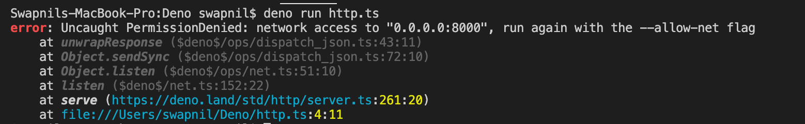

# http-server

```ts
// Imports the http package form standard library of Deno
import { serve } from "https://deno.land/std/http/server.ts";

// Server Configuration
const s = serve({ port: 8000 });

// This is Async Iterable a Modern Javascript Feature. Deno also supports promises & top-level Await
for await (const req of s) {
  req.respond({ body: "Hello World\n" });
}
```

### Running the code

```sh
deno run --allow-net http-server.ts
```

For running you need to pass an `--allow-net` else permissions to access network will be denied resulting in below error


