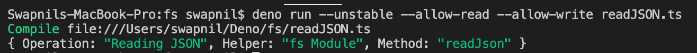
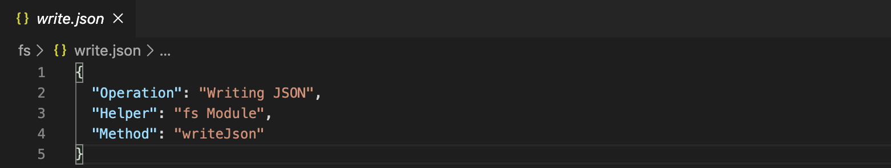

# Reading & Writing JSON

### Reading JSON from a file

We are using fs module to read the json file form file system

```ts
// Import fs module form standard library of Deno
import { readJson } from "https://deno.land/std/fs/mod.ts";

// Reads the JSON from file Asynchronously using top level await
const data = await readJson("./read.json");

// Print contents of file
console.log(data);
```

#### Running the code

```sh
deno run --unstable --allow-read --allow-write fileName.ts
```

For running you need to pass an `--allow-read` & `--allow-write` else permissions to access file system will be denied resulting in error.

All functionality which is not yet ready for stabilization has been hidden behind the `--unstable` command-line flag.

#### Output



### Writing JSON to a file

We are using fs module to write json into the file

```ts
import { writeJson } from "https://deno.land/std/fs/mod.ts";

// Writes JSON into the file with the indentation option of 2 spaces
writeJson(
  "./write.json",
  {
    Operation: "Writing JSON",
    Helper: "fs Module",
    Method: "writeJson",
  },
  { spaces: 2 }
);
```

#### Output


